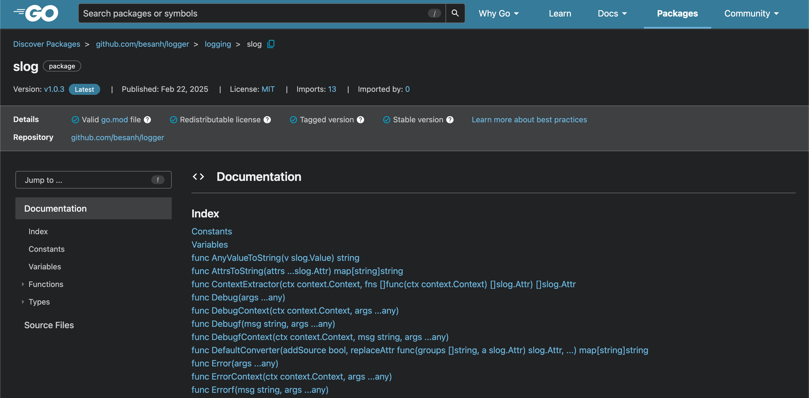
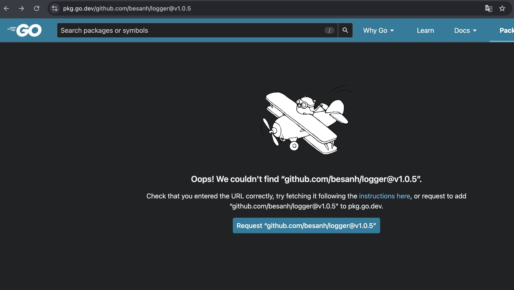

# INSTRUCTIONS

I will guide you public source code to **https://pkg.go.dev**. It depends on primary purpose's project, if you want to public a library for other projects utilize this package in logging and tracing data.

1. If possible, you should add license as creating the repository, because **go pkg** require all package have to license, or
you can create it later, ensuring LICENSE file is existed constantly
2. Create a release tag

    ```
    git tag v1.0.0

    git push origin v1.0.0
    ```

    Access repository on github site and create **release tag**

3. Access package on **pkg.go.dev**

    Link: https://pkg.go.dev/github.com/besanh/**{{module name}}**

    

4. If pkg go site can't update new latest version, you can try 2 approaches
Use command line Go proxy:
```
curl https://proxy.golang.org/github.com/besanh/**{{module name}}**/@v/**{{tag version}}**.info`
```
    
=> `{"Version":"v1.0.4","Time":"2025-02-22T05:22:52Z","Origin":{"VCS":"git","URL":"https://github.com/besanh/logger","Hash":"bf86b3e43a695e6fafc2601e2075b6926a080984","Ref":"refs/tags/v1.0.4"}}``

Fetch data on direct pkg go site:
    
```
https://pkg.go.dev/github.com/besanh/logger
```

and click to fetch data


5. Notice that your github name should start with lowercase. It means **besanh** due to **Besanh**